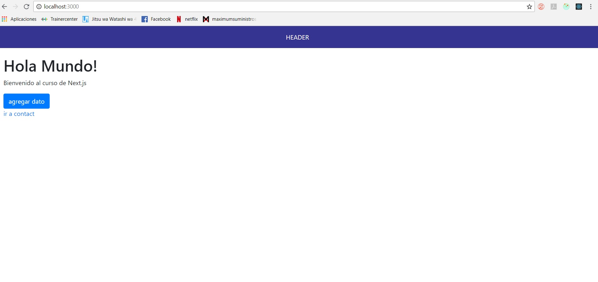

## App web basica de Hola Mundo

App basica para comenzar proyectos con next-react-redux-jest-enzyme
el comienzo es este:

## Como Correr este proyecto:

* `npm install` para instalar todas las dependencias
* `npm run dev` para correr modo desarrollador y abrir http://localhost:3000/
* `npm run build` para hacer webpack
* `npm run start` para correr modo produccion segun webpack y abrir http://localhost:3000/

-----------------------------------------------
step by step to create a netx-react-redux app
1-npm init
2- npm install:

-DEV
* `npm install -d babel-jest babel-preset-stage-0 enzyme jest-cli react-addons-test-utils react-test-renderer redux-mock-store sinon enzyme enzyme-adapter-react-16 enzyme-to-json identity-obj-proxy jest babel-jest babel-core@^7.0.0-bridge.0 @babel/core regenerator-runtime @babel/preset-env @babel/preset-react @babel/plugin-proposal-class-properties` librerias dev

-PRODUCCION
* `npm install --save next react react-dom react-redux immutable redux redux-saga axios prop-types next-redux-saga next-redux-wrapper redux-devtools-extension redux-immutable redux-logger redux-thunk @babel/core babel-preset-env babel-preset-react` librerias pro

El enzyme-adapter-react-16 tiene que ser de la misma version que react, si react es 16 se debe instalar el 16.

STRUCTURE OF THE PROJECT (> significa carpeta y los _ son parte del nombre)
>node_modules
>pages
    _app.js
    _document.js
    _error.js
    index.js (esta seria el home)
    contact.js (esta seria la vista de contact)
>src 
    >_test_ (esta es la configuracion para pruebas con jest y jasmine)
    >components (aqui van los componentes genericos)
    >pages (aqui van las vistas)
        >home
            >component
            >container
            >css
        >contact
            >component
            >container
            >css
    >redux
        >action-types
        >actions
        >reducers
        >sagas (de redux-saga)
        store.js
>static (aqui van las imagenes)
package.json
readme

--testing: usaremos una libreria llamada jasmine https://jasmine.github.io/
y para correr el test usaremos un framework (jest o mocha) jest es mas nuevo
por lo que no tiene mucha documentacion pero es mas amigable y facil de
configurar y mucha es lo contrario por lo que usaremos jest y una libreria
llamada enzime https://github.com/airbnb/enzyme 

--rutas custom (para que sea mas amigable con el usuario) usar next-routes

